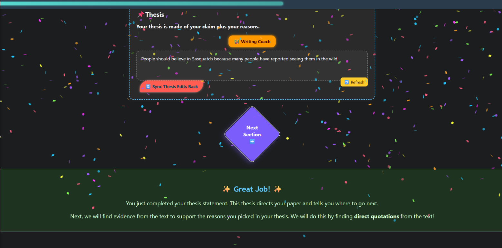

# 🧠 Argumentative Essay Organizer

An interactive, accessible, and colorful writing organizer to help students structure strong argumentative essays—built with HTML, CSS, and JavaScript.

## ✨ Features

- 🎯 Dynamic thesis and reason builder
- 🧩 Configurable 1–3 body paragraph structure
- 🎉 Progress tracking & celebration effects
- 🗣️ Read-aloud accessibility tools
- 🧠 Function based writing tips (no auto-writing!)
- 🌍 Translation tooltips & multilingual support
- 📝 Save/load via Google Drive or local files

## 🚀 How to Use

1. Open `graphic_organizer.html` in your browser.
2. Toggle Evidence-First Mode if preferred.
3. Fill out the writing prompt and build your claim.
4. Use sentence starter buttons and tips along the way.
5. Save your work to Google Drive or as a local file.
6. Export the final essay to Google Docs.

## 🔐 Note

Make sure your `config.js` file contains your private Google API credentials, but **do not upload this file to GitHub**. It's listed in `.gitignore` for safety.

## 📸 Preview

 <!-- Optional, replace with a real screenshot later -->

## 📚 Built With

- HTML5
- CSS3 (Dark/Light mode + custom color palette)
- JavaScript (modular structure)
- Google Drive API + Docs API

---

## 🙋‍♀️ About the Creator

This project was built by a former special education teacher turned front-end developer. Designed with middle and high school students in mind—especially those who need scaffolded writing support.

---

## 📄 License

MIT License — feel free to remix with attribution!
